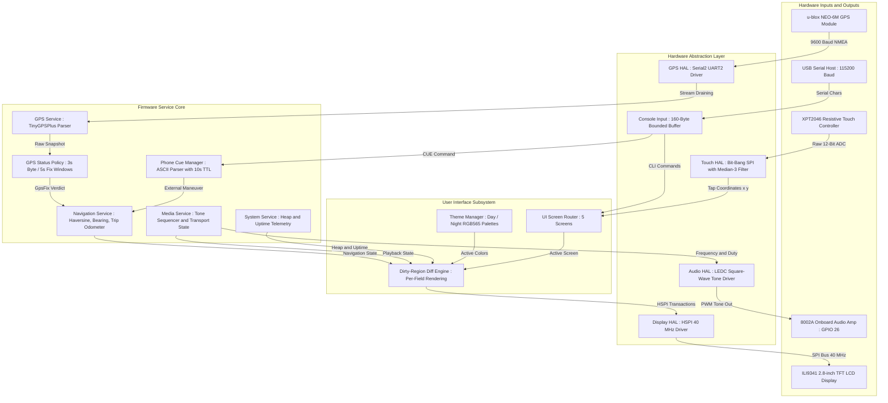
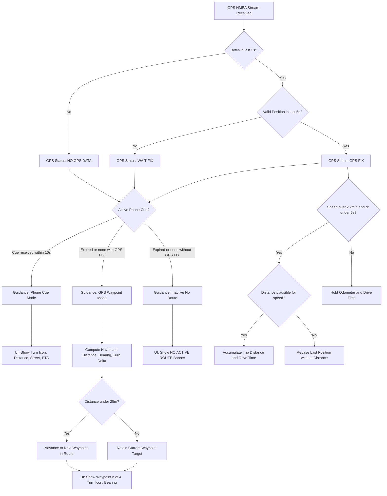
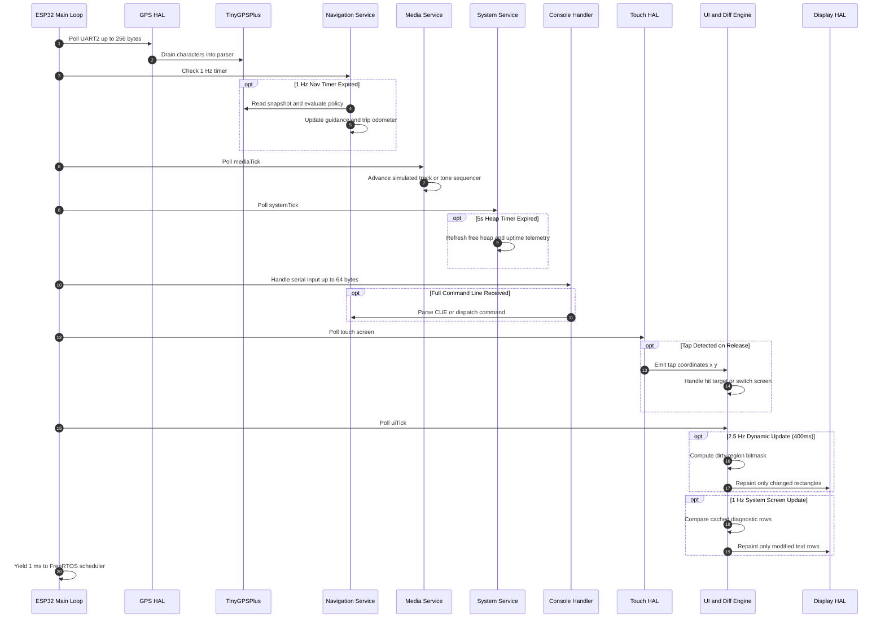
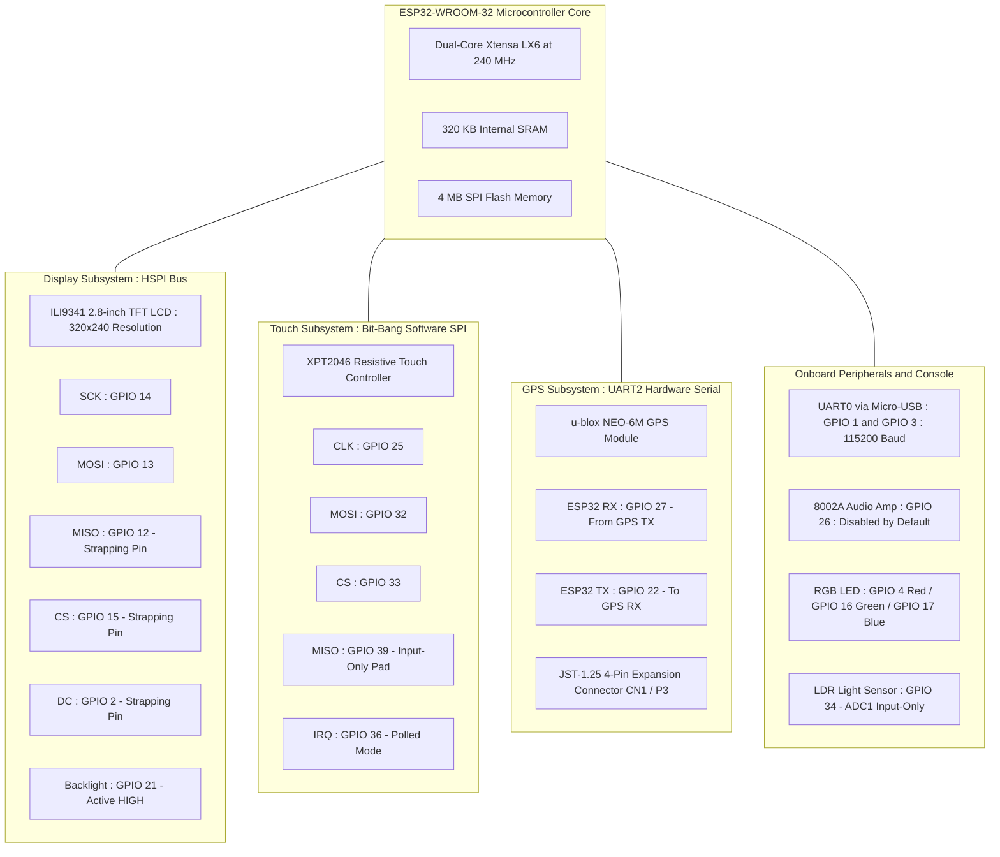

# CYD-Build

[](https://www.espressif.com/)
[](https://github.com/jashjain-1/CYD-Build)
[](https://github.com/espressif/arduino-esp32)
[](https://platformio.org/)
[](https://github.com/jashjain-1/CYD-Build)
[](docs/DECISIONS.md)
[](LICENSE)

An independent, production-grade embedded head-unit firmware engineered from the ground up for the **ESP32-2432S028R** (popularly known as the "Cheap Yellow Display" or CYD). CYD-Build provides standalone GPS waypoint guidance, trip computer telemetry, external turn-by-turn phone cue ingestion, media playback transport controls, and an automotive UI with Day/Night adaptive theming and per-region dirty redraw on a 2.8-inch 320x240 ILI9341 display.

CYD-Build is a clean-room implementation. It shares zero code, history, or build artifacts with previous prototypes, isolating safety policies and navigation mathematics in pure C++ modules backed by four host-executed unit test suites.

---

## Table of Contents

- [Executive Overview](#executive-overview)
- [System Architecture and Dataflow](#system-architecture-and-dataflow)
- [State Machine and Fallback Architecture](#state-machine-and-fallback-architecture)
- [Execution Loop and Concurrency](#execution-loop-and-concurrency)
- [Hardware Wiring and Pinout](#hardware-wiring-and-pinout)
- [User Interface Subsystem](#user-interface-subsystem)
- [Protocol and Command Reference](#protocol-and-command-reference)
- [Implemented vs. Planned Feature Matrix](#implemented-vs-planned-feature-matrix)
- [Quick Start Guide](#quick-start-guide)
- [Testing and Verification Guide](#testing-and-verification-guide)
- [Engineering Limitations and ADRs](#engineering-limitations-and-adrs)

---

## Executive Overview

### The Problem
Off-the-shelf smart vehicle displays and open-source head units frequently suffer from:
1. **Unbounded Heap Fragmentation:** Dynamic allocations (`malloc`, `String`, vector resizes) inside rendering and serial parsing loops trigger heap degradation over multi-hour drives.
2. **High Display Latency and SPI Bottlenecks:** Naive full-screen repainting over SPI at 1 Hz to 2 Hz induces visible tearing, flickering, and high MCU core utilization.
3. **Resistive Touch Instability:** Electrical noise on cheap resistive touch overlays (XPT2046) causes false taps, stuck drag states, and misfires under vehicle vibration.
4. **Fragile Navigation Fallbacks:** Poor isolation between hardware GPS fixes and simulated/external cues results in unhandled dropouts, odometer teleportation bugs, and locked navigation states.

### Architectural Solution
CYD-Build resolves these challenges with deterministic embedded design patterns:
- **Zero Dynamic Allocation (ADR-0010):** All state, ring buffers, console line buffers, and telemetry caches are statically allocated at compile time.
- **Per-Region Dirty Redraw Engine (ADR-0007):** Navigation and dashboard fields use dirty bitmasks. In steady-state driving, only the modified field (e.g. drive time) repaints, reducing SPI traffic by up to 80% on the ILI9341 HSPI bus.
- **Median-3 Filter and Press-Release Touch Engine (ADR-0006):** Three ADC samples per axis are sorted via median-of-3 to filter electrical spikes. Taps register strictly on release, and touches held longer than 1,000 ms are dropped as stuck or ghost inputs.
- **Padded Hit Rectangles (ADR-0008):** Visual elements maintain compact automotive typography, but touch target hitboxes are enlarged to 44 px to 48 px minimum (Fitts's law compliant).
- **Pure Safety and Navigation Math (ADR-0004):** Haversine distance, bearing calculations, turn classification, and GPS staleness policies are implemented without Arduino hardware dependencies, allowing 100% desktop host verification.

---

## System Architecture and Dataflow

The system is organized into four decoupled layers: Physical Hardware, Hardware Abstraction Layer (HAL), Core Services, and UI / Presentation.



---

## State Machine and Fallback Architecture

Guidance and telemetry flow through a deterministic fallback pipeline. External smartphone cues take precedence, falling back to autonomous GPS waypoint tracking on timeout, and finally to an inactive state when satellite fix is lost.



### Staleness and Boundary Safety Invariants
- **GPS Byte Window (`GPS_RECEIVING_MS = 3000 ms`):** If no bytes arrive across UART2 for 3 seconds, reception is flagged false.
- **GPS Fix Window (`GPS_STALE_MS = 5000 ms`):** If no valid location sentence arrives within 5 seconds, fix status reverts to invalid. Boundary evaluation is strictly `<` (tested by `gps_status_host_test.cpp`).
- **Phone Cue Expiry (`PHONE_CUE_STALE_MS = 10000 ms`):** Phone turn instructions expire after 10 seconds of silence. Guidance instantly reverts to GPS waypoint tracking or idle without blocking.
- **Odometer Anti-Teleportation Gate:** Position deltas between fixes are checked against `maxDistance = (300 km/h / 3.6) * dt / 1000 + 10 m`. Any teleport jump caused by satellite multipath or reacquisition is discarded, while the baseline position is updated to resume accurate tracking.

---

## Execution Loop and Concurrency

The firmware operates on a single-threaded cooperative scheduling model. No task blocks, and the loop yields with `delay(1)` at the end of each pass to service background FreeRTOS tasks (watchdog, Wi-Fi stack idle).



---

## Hardware Wiring and Pinout

### Target A: ESP32-2432S028R "CYD" (Default Target, `env:cyd`)

The ESP32-2432S028R integrates an ESP32-WROOM-32 with a 2.8-inch ILI9341 display and an XPT2046 resistive touch overlay. Due to PCB routing constraints, the touch controller MISO pin is wired to GPIO 39 (an ESP32 input-only pad), making hardware SPI sharing impossible and requiring a dedicated software bit-bang SPI engine.



#### Pin Assignment Reference Table

| Subsystem | Signal Name | GPIO Pin | Bus / Interface | Electrical / Implementation Notes |
|:---|:---|:---:|:---|:---|
| **Display** | TFT SCK | `GPIO 14` | HSPI | 40 MHz clock (fall back to 20 MHz if breadboarding) |
| **Display** | TFT MISO | `GPIO 12` | HSPI | ESP32 strapping pin. Connected on PCB; do not repurpose |
| **Display** | TFT MOSI | `GPIO 13` | HSPI | High-speed data out to ILI9341 |
| **Display** | TFT CS | `GPIO 15` | HSPI | ESP32 strapping pin. Maintained HIGH during boot |
| **Display** | TFT DC | `GPIO 2` | HSPI | ESP32 strapping pin. Data/Command select |
| **Display** | TFT RST | `-1` | Direct | Hardwired to ESP32 EN line; handled by reset circuit |
| **Display** | Backlight | `GPIO 21` | GPIO Output | Active HIGH. Driven HIGH at boot or screen stays dark |
| **Touch** | Touch CLK | `GPIO 25` | Software SPI | Dedicated bit-bang clock |
| **Touch** | Touch MOSI | `GPIO 32` | Software SPI | Dedicated bit-bang MOSI |
| **Touch** | Touch CS | `GPIO 33` | Software SPI | Dedicated chip select |
| **Touch** | Touch MISO | `GPIO 39` | Software SPI | **Input-only pin (SENSOR_VN)**; requires software SPI |
| **Touch** | Touch IRQ | `GPIO 36` | Input | Input-only (SENSOR_VP); unused, polling rate >= 20 ms |
| **GPS** | UART2 RX | `GPIO 27` | UART2 (9600) | Connected to u-blox NEO-6M TX via JST-1.25 CN1/P3 |
| **GPS** | UART2 TX | `GPIO 22` | UART2 (9600) | Connected to u-blox NEO-6M RX (config commands) |
| **Console** | UART0 RX/TX | `GPIO 3 / 1` | USB UART | 115200 baud console, flashing, and phone cue stream |
| **Audio** | Speaker Amp | `GPIO 26` | DAC / LEDC | Onboard 8002A amp. **Disabled by default** (ADR-0003) |
| **Onboard** | RGB Red | `GPIO 4` | GPIO Output | Active LOW (unmanaged by base firmware) |
| **Onboard** | RGB Green | `GPIO 16` | GPIO Output | Active LOW (unmanaged by base firmware) |
| **Onboard** | RGB Blue | `GPIO 17` | GPIO Output | Active LOW (unmanaged by base firmware) |
| **Sensor** | LDR Photo | `GPIO 34` | ADC1 Input | Analog ambient light sensor (input-only pad) |

### Target B: Legacy ESP32 DevKit (`env:esp32dev`, `env:esp32dev_audio`)
Retained for bench testing and breadboard setups:
- **TFT (VSPI):** SCK `18`, MISO `19`, MOSI `23`, CS `5`, DC `16`, RST `17` @ 20 MHz.
- **Touch (VSPI Shared):** Uses standard `XPT2046_Touchscreen` library on CS `4`.
- **GPS (UART2 Remapped):** RX `32`, TX `33` @ 9600 baud.
- **Optional Audio:** PAM8403 tone output on GPIO `25` (enabled only in `esp32dev_audio`).

---

## User Interface Subsystem

The user interface is designed specifically for in-vehicle legibility, high contrast, and responsive touch operation without sluggish widget frameworks.

### Screen Roster
1. **HOME:**
   - Persistent top status bar with screen title, build mode badge (HW or SIM), and Day/Night theme indicator.
   - GPS Status Chip (`NO GPS DATA`, `WAIT FIX`, `GPS FIX`, `EXTERNAL CUE`). On HOME, tapping the chip acts as a quick shortcut to the NAVIGATION screen.
   - Four primary launch buttons: `DASHBOARD`, `NAVIGATION`, `MEDIA`, and `SYSTEM` (each 44 px tall with geometric icons).
2. **DASHBOARD:**
   - Large numeric speed indicator (km/h) with GPS speed validity checks.
   - Current heading readout with cardinal direction (e.g. `045 deg NE`).
   - Trip computer metrics: Trip Distance (km), Max Speed (km/h), Average Speed (km/h), and Drive Time (s).
   - Touch action bar: `SWITCH NAV` (shortcut) and `RESET TRIP` (re-zeros odometer and timers).
3. **NAVIGATION:**
   - Direction maneuver card: Renders vector turn arrows (`STRAIGHT`, `LEFT`, `RIGHT`, `SLIGHT LEFT`, `SLIGHT RIGHT`, `U-TURN`, `ROUNDABOUT`, `ARRIVED`).
   - Distance to next maneuver / waypoint in meters or kilometers.
   - Street / Waypoint banner: Shows active street name or waypoint index (e.g. `Waypoint 1/4 - direct bearing`).
   - Secondary telemetry cards: Speed, heading, bearing to target, and estimated time of arrival (ETA).
   - Source indicator: `GPS Waypoint Mode` vs `External cue (10s timeout)`.
4. **MEDIA:**
   - Track telemetry card: Displays track title, artist, and playback state (`playing`, `paused`, `stopped`).
   - Progress bar: Renders track playback position (SIM player auto-advances through 3 demo tracks).
   - Transport controls: Large hit-area `PREV`, `PLAY/PAUSE`, and `NEXT` buttons.
   - Volume slider: 11-step volume bar (0 to 10) with dedicated `VOL -` and `VOL +` touch zones.
   - Audio feedback: Generates two-tone audio blips on state changes when audio is enabled.
5. **SYSTEM:**
   - Nine real-time diagnostic rows: Theme, Build Target, GPS Status, NMEA Byte Count, Display Driver, Audio Status, Free Heap (KB), System Uptime (s), Firmware Version.
   - Dynamic caching: Diagnostic rows are cached as text/color tuples. In steady state, SPI writes are zero until a field changes.
   - `TOGGLE DAY / NIGHT` touch button.

### Adaptive Day / Night Theming
The palette conforms to automotive ergonomics, avoiding washed-out backgrounds at night and low-contrast text in sunlight.

| Color Token | Day Palette (Hex / RGB565) | Night Palette (Hex / RGB565) | Usage Description |
|:---|:---:|:---:|:---|
| `BG` | `0xF7BE` (Light Gray) | `0x0000` (Pure Black) | Main screen background |
| `SURFACE` | `0xFFFF` (Pure White) | `0x18E3` (Dark Charcoal) | Card and container panels |
| `SURFACE2` | `0xDEFB` (Border Gray) | `0x2965` (Border Dark) | Progress bar frames and subtle dividers |
| `TEXT` | `0x0841` (Deep Charcoal) | `0xFFFF` (Pure White) | Primary readouts, headings, metrics |
| `MUTED` | `0x632C` (Medium Slate) | `0x8410` (Medium Gray) | Labels, units, secondary timestamps |
| `ACCENT` | `0x0277` (Deep Blue) | `0x3D1F` (Electric Cyan) | Active buttons, speed highlights |
| `GOOD` | `0x04A3` (Forest Green) | `0x07E0` (Bright Green) | GPS fix confirmed, play icon, valid cues |
| `WARN` | `0xCBA0` (Amber Gold) | `0xFD20` (Vivid Orange) | Waiting for GPS fix, no active route |
| `BAD` | `0xC9A2` (Brick Red) | `0xF800` (Vivid Red) | GPS disconnected, syntax errors |

---

## Protocol and Command Reference

All serial communication occurs over the onboard USB UART at **115200 baud, 8N1**. The console processor uses a statically sized 160-byte buffer that discards overflowing lines without executing corrupted prefixes.

### Serial CLI Commands

| Command | Arguments | Description | Example Response |
|:---|:---|:---|:---|
| `STATUS` | None | Emits full diagnostic dump covering build, GPS, trip computer, media, and memory | Serial diagnostic block |
| `TOUCHTEST` | None | Toggles touch diagnostic mode. Pauses UI and echoes raw touch coordinates to serial | `[CMD] touch test ON (taps print, UI paused)` |
| `GPSRAW` | None | Toggles echoing raw NMEA sentences directly from UART2 to UART0 for wiring verification | `[CMD] GPS raw echo ON` |
| `HOME` | None | Switches active UI display to HOME screen | Switches UI to Home |
| `DASH` | None | Switches active UI display to DASHBOARD screen | Switches UI to Dashboard |
| `NAV` | None | Switches active UI display to NAVIGATION screen | Switches UI to Navigation |
| `MEDIA` | None | Switches active UI display to MEDIA screen | Switches UI to Media |
| `SYS` | None | Switches active UI display to SYSTEM screen | Switches UI to System Diagnostics |
| `THEME` | None | Toggles adaptive theme between Day and Night palettes | `[CMD] theme toggled: NIGHT` |
| `TRIPRESET` | None | Resets trip distance, max speed, average speed, and drive timer to zero | `[CMD] trip odometer reset` |
| `NAVRESET` | None | Resets guidance engine and re-indexes waypoint list back to waypoint 0 | `[CMD] nav reset` |
| `BT` | None | Toggles simulated Bluetooth phone connection (simulation build only) | `[CMD] BT simulated connection: CONNECTED` |
| `TAP` | `<x> <y>` | Injects a simulated tap coordinate (0-319, 0-239) (simulation build only) | `[CMD] tap injected at 160,108` |
| `HELP` or `?`| None | Prints full command roster and usage summary | Lists all available commands |

### Phone Turn-by-Turn Cue Protocol (`CUE`)
The head unit accepts turn-by-turn maneuvers from companion computers, Bluetooth bridges, or automated scripts using a compact pipe-delimited ASCII protocol.

#### Format Specification
```text
CUE <ICON>|<distance>|<street>|<eta>|<speed>
```

#### Field Constraints
1. `<ICON>`: Required. Must be one of: `STRAIGHT`, `LEFT`, `RIGHT`, `SLEFT`, `SRIGHT`, `UTURN`, `ROUND`, `ARRIVE`.
2. `<distance>`: Required string (1 to 15 printable ASCII chars). Examples: `250 m`, `1.2 km`.
3. `<street>`: Required string (1 to 31 printable ASCII chars). Example: `MG Road`.
4. `<eta>`: Required string (1 to 15 printable ASCII chars). Use `-` if unknown. Example: `12 min`.
5. `<speed>`: Required decimal value between `0.0` and `300.0` km/h. Values like `nan`, `inf`, `-1`, or `301` are rejected.

#### Valid Syntax Examples
```bash
# Standard turn cue
CUE LEFT|250 m|MG Road|12 min|40

# Highway straight cue with unknown ETA
CUE STRAIGHT|1.5 km|Outer Ring Road|-|65

# Roundabout maneuver
CUE ROUND|100 m|Central Square|3 min|25
```

#### Rejection and Expiry Behavior
- If any field is missing, exceeds buffer limits, contains non-ASCII bytes, or has an invalid speed, the cue is rejected, the current guidance remains untouched, and a syntax hint is printed.
- A valid cue takes over the navigation screen and displays `EXTERNAL CUE` on the status chip.
- Cues expire after exactly **10,000 ms** (`PHONE_CUE_STALE_MS`). Once expired, guidance seamlessly falls back to the autonomous GPS waypoint route.

---

## Implemented vs. Planned Feature Matrix

Truth-in-documentation inventory reflecting actual codebase capabilities:

| Feature / Subsystem | Implementation Status | Verification Method | Technical Notes |
|:---|:---:|:---|:---|
| **ILI9341 HSPI Display Driver** | Production Implemented | `pio run -e cyd` | 40 MHz SPI clock on CYD pin map with active-HIGH backlight control |
| **XPT2046 Bit-Bang Touch Driver** | Production Implemented | Bench / Host stub | Median-of-3 filter, press-release tap detection, >1s stuck rejection |
| **Padded Hit Targets (44px+)** | Production Implemented | Code Inspection / Visual | Back chevron 48x48, volume 48x44, actions 150x44, theme zone 70x32 |
| **Per-Region Dirty UI Redraw** | Production Implemented | Code Inspection / Host | Bitmask diffs for nav/dash; text/color caching for system diagnostics |
| **Adaptive Day / Night Theme** | Production Implemented | Host test / Visual | Full RGB565 palette swap triggered via tap, serial CLI, or system button |
| **5 In-Vehicle Screens** | Production Implemented | Host test / Visual | HOME, DASHBOARD, NAVIGATION, MEDIA, SYSTEM screens fully operational |
| **u-blox NEO-6M NMEA Parser** | Production Implemented | Host Test / Bench | TinyGPSPlus integration bounded to <=256 bytes per loop pass |
| **GPS Staleness Policy** | Production Implemented | `gps_status_host_test` | Pure evaluator: 3s byte flow, 5s position staleness boundaries |
| **Haversine Distance & Bearing** | Production Implemented | `nav_nmea_host_test` | Double precision spherical trigonometry with antipodal boundary protection |
| **Autonomous Waypoint Guidance**| Production Implemented | `services_hw` test | 4-waypoint Bangalore demo route, 25m arrival radius, auto-looping |
| **Trip Computer Telemetry** | Production Implemented | `services_hw` test | Trip odometer, drive time, max speed, average speed, jump rejection |
| **External Phone Cue (`CUE`)** | Production Implemented | `services_hw` test | 5-field ASCII validator, 10s TTL expiry, automatic GPS fallback |
| **Serial CLI Command Processor**| Production Implemented | `services_hw` test | 160-byte bounded buffer, overflow protection, instant command dispatch |
| **LEDC Tone Output Generator** | Implemented (Disabled) | Compile / ADR-0003 | Audio disabled by default on CYD to protect unattenuated 8002A amp |
| **Zero Dynamic Allocations** | Production Implemented | Host / Static audit | Zero heap fragmentation; all buffers statically allocated |
| **Physical Bluetooth Audio (SBC)** | Planned / Roadmap | None | Requires ESP-ADF / I2S DAC; currently simulated via transport state |
| **Physical BLE GATT Navigation** | Planned / Roadmap | None | Serial CUE protocol acts as the hardware bridge specification |
| **Non-Volatile Storage (NVS)** | Planned / Roadmap | None | Trip odometer and theme state reset on power cycle by design |
| **Ambient Light Sensor Auto-Dim**| Planned / Roadmap | None | LDR is connected on GPIO 34 but auto-backlight PWM is unmapped |

---

## Quick Start Guide

### Prerequisites
1. **PlatformIO Core:** Install via Python virtual environment:
   ```bash
   pip install platformio
   ```
2. **C++11 Desktop Compiler (for Host Tests):**
   - Windows: MinGW-w64 (`g++` on PATH)
   - Linux: `build-essential` (`sudo apt install build-essential`)
   - macOS: Xcode Command Line Tools (`xcode-select --install`)
3. **Hardware Kit:**
   - ESP32-2432S028R ("Cheap Yellow Display") board.
   - u-blox NEO-6M GPS module connected via JST-1.25 4-pin cable.
   - Micro-USB cable (data-capable).

### Building and Flashing

All build environments are defined in `firmware/platformio.ini`.

```bash
# Navigate to the firmware workspace
cd firmware

# Compile the production firmware for the CYD board
pio run -e cyd

# Compile and upload directly to an attached CYD board
pio run -e cyd -t upload

# Open the serial monitor at 115200 baud
pio device monitor -b 115200
```

### Alternative Environments

```bash
# Simulation build with software NMEA generator and auto-demo tap stream
pio run -e sim

# Legacy DevKit wiring target (VSPI panel + XPT2046 library)
pio run -e esp32dev

# Legacy DevKit with GPIO 25 audio feedback tones enabled
pio run -e esp32dev_audio
```

---

## Testing and Verification Guide

CYD-Build enforces a comprehensive testing regime. Core math, NMEA sentence generation, state machines, and console parsers are decoupled from the Arduino runtime and validated natively on the host computer.

### Running Host Unit Tests

No microcontroller hardware or PlatformIO installation is needed to run host unit tests.

#### Windows
```cmd
run-tests.cmd
```

#### Linux and macOS
```bash
chmod +x run-tests.sh
./run-tests.sh
```

### Host Test Suite Roster

```text
============================================================================
Host Test Suites (Compiled with g++ -std=c++11 into .test-build/)
============================================================================
1. nav_nmea_host_test.cpp:
   - NMEA checksum calculation, associative split framing, and buffer bounds.
   - Haversine distance accuracy, antipodal boundary safety, symmetry.
   - Initial bearing calculation and degree normalization [0, 360).
   - Turn angle delta calculation [-180, 180) across North wrap-around.
   - Waypoint arrival radius detection and flat-earth offset vectors.

2. services_host_test.cpp (Hardware Mode, SIM_BUILD=0):
   - Console line buffer handling, CR/LF stripping, and overflow discard.
   - 5-field phone cue parser: field limits, speed clamps, invalid icons.
   - Phone cue 10s timeout expiry and fallback to GPS guidance.
   - GPS odometer accumulation, anti-stall, and teleportation jump rejection.
   - Trip computer max speed and average speed accounting.
   - millis() rollover safety across 32-bit integer boundaries.

3. services_host_test.cpp (Simulation Mode, SIM_BUILD=1):
   - Validates simulated media track auto-advancement and transport states.
   - Verifies simulated Bluetooth connection gating.

4. gps_status_host_test.cpp:
   - Boundary tests for GPS reception window (GPS_RECEIVING_MS = 3000 ms).
   - Boundary tests for GPS position staleness (GPS_STALE_MS = 5000 ms).
   - Disconnected receiver, stale fix, and invalid satellite state validation.
============================================================================
```

### On-Device Verification Procedure (Stages 1 through 6)
Refer to [docs/TEST-PROCEDURE.md](docs/TEST-PROCEDURE.md) for the end-to-end bench check procedure:
- **Stage 1 (Display):** Verify 40 MHz SPI signal integrity and backlight init.
- **Stage 2 (GPS):** Validate NMEA character flow via `GPSRAW` and verify fix acquisition within 30 seconds.
- **Stage 3 (Touch):** Execute `TOUCHTEST` to verify corner calibration (`(0,0)` to `(319,239)`).
- **Stage 4 (UI Walkthrough):** Cycle through all five screens and test Day/Night theme toggle.
- **Stage 5 (Console):** Inject test cues (`CUE LEFT|250 m|MG Road|12 min|40`) and observe expiry.
- **Stage 6 (Soak Test):** Execute a 30-minute burn-in to verify that free heap remains flat.

---

## Engineering Limitations and ADRs

### Architecture Decision Records (Summary)
Detailed rationale is maintained in [docs/DECISIONS.md](docs/DECISIONS.md):
- **ADR-0001 (Clean-Room Reimplementation):** Independent codebase free of legacy technical debt.
- **ADR-0002 (PlatformIO Board Dispatcher):** Compile-time pin headers prevent building invalid pin assignments.
- **ADR-0003 (Audio Disabled by Default):** Protects the onboard 8002A speaker amp from overdriving until an analog attenuation circuit is installed.
- **ADR-0004 (Pure Safety Policy):** GPS fix validity logic is strictly isolated in pure C++ headers for 100% host testability.
- **ADR-0005 (Registry Dependency Pinning):** Pins `Adafruit ILI9341 @ 1.6.4` and `XPT2046_Touchscreen @ v1.4` to ensure reproducible builds.
- **ADR-0006 (Median-3 Touch Filter):** Suppresses resistive noise spikes and prevents phantom drag taps.
- **ADR-0007 (Per-Region Dirty Redraw):** Diff engine limits repainting to modified dynamic fields, eliminating SPI bus saturation.
- **ADR-0008 (Padded Hit Rectangles):** Enlarges touch hitboxes to 44 px to 48 px without modifying visual layout typography.
- **ADR-0009 (GPS Chip Shortcut):** Tapping the GPS status chip on the HOME screen opens NAVIGATION.
- **ADR-0010 (Zero Dynamic Allocations):** Complete prohibition of heap allocations (`malloc`, `new`, `String`) inside runtime loops.

### Honest Hardware and Software Limitations
1. **No Non-Volatile Persistence:** Trip mileage and theme settings reset upon power loss. Permanent storage via ESP32 NVS flash is slated for a future release.
2. **Resistive Touch Limitations:** The XPT2046 overlay requires physical pressure (stylus or firm fingernail/finger press). It does not support capacitive multi-touch gestures like pinch-to-zoom.
3. **No Native Bluetooth Audio Sink (A2DP):** The ESP32's internal DAC and onboard 8002A amplifier cannot decode high-fidelity stereo audio. The MEDIA screen currently acts as a remote transport interface.
4. **Single-Port GPS Configuration:** UART2 communicates with the u-blox NEO-6M at the default 9600 baud rate. High-baud (115200) binary UBX protocol streaming is not implemented.

---

## Directory Layout

```text
CYD-Build/
├── .gitignore                  Build and OS exclusions (PIO, test binaries, editor metadata)
├── README.md                   Primary technical manual and repository documentation
├── run-tests.cmd               Windows host test runner (MinGW g++)
├── run-tests.sh                Linux / macOS host test runner (g++)
├── docs/
│   ├── BOM.md                  Bill of materials and part numbers
│   ├── DECISIONS.md            Architecture Decision Records (ADR-0001 to ADR-0010)
│   ├── FEATURE-MATRIX.md       Regression baseline and subsystem verification matrix
│   ├── PHONE-EXTENSION.md      Phone cue serial protocol specification
│   ├── TEST-PROCEDURE.md       Six-stage hardware and soak verification guide
│   └── WIRING.md               Comprehensive pinout tables (CYD and DevKit)
└── firmware/
    ├── platformio.ini          PlatformIO environments (cyd, esp32dev, sim, esp32dev_audio)
    ├── include/
    │   ├── config_build.h      Timing, baud, buffer thresholds, and build constants
    │   ├── config_pins.h       Target dispatcher header
    │   ├── config_pins_cyd.h   ESP32-2432S028R pin definitions
    │   ├── config_pins_devkit.h Legacy DevKit pin definitions
    │   ├── console_input.h     Bounded 160-byte serial line buffer
    │   ├── demo_route.h        4-waypoint demo navigation route coordinates
    │   ├── nav_math.h          Pure C++ Haversine, bearing, and turn calculations
    │   ├── nmea_builder.h      NMEA 0183 checksum framing utilities (sim only)
    │   ├── phone_cue.h         5-field phone cue ASCII parser
    │   ├── hal/                Hardware abstraction interfaces (display, touch, GPS, audio)
    │   ├── services/           Core business logic (GPS, nav, media, system)
    │   └── ui/                 Screens, layout geometries, and Day/Night color palettes
    ├── src/
    │   ├── main.cpp            Main setup() and non-blocking loop() entry point
    │   ├── demo_route.cpp      Waypoint definitions
    │   ├── hal/                Hardware driver implementations
    │   ├── services/           Service implementations
    │   └── ui/                 Screen drawing and event handling implementations
    └── test/
        ├── gps_status_host_test.cpp Host suite: GPS staleness and reception policy
        ├── nav_nmea_host_test.cpp   Host suite: Math and NMEA sentence formatting
        ├── services_host_test.cpp   Host suite: Guidance, trip computer, phone cues
        └── host/
            └── Arduino.h            Lightweight host stub for compilation under g++
```

---

## License

This project is licensed under the MIT License. See [LICENSE](LICENSE) for details.
